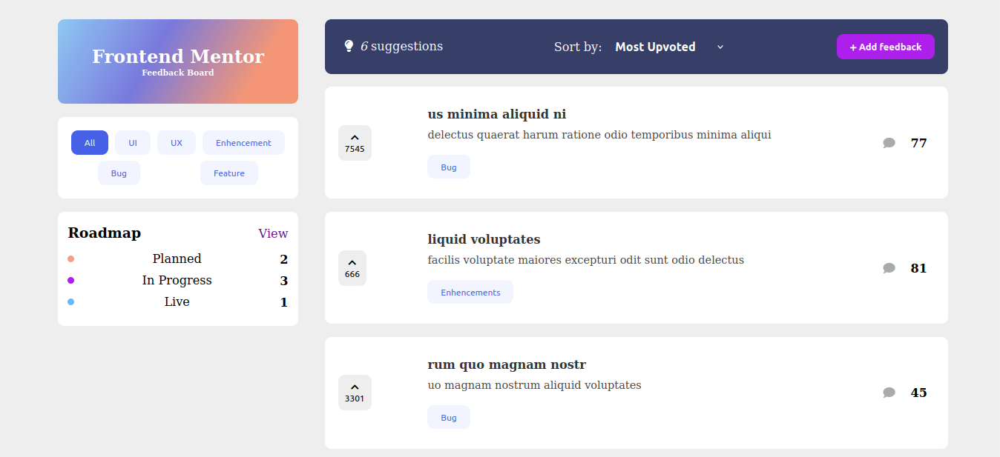
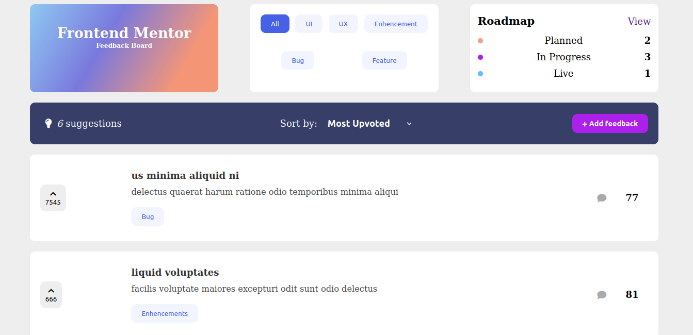
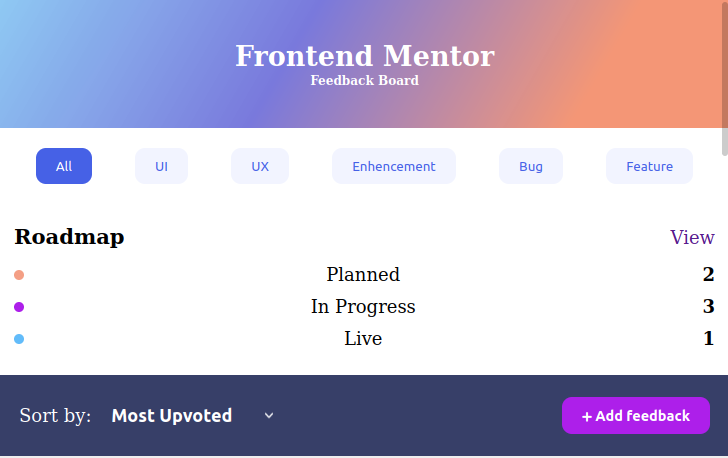
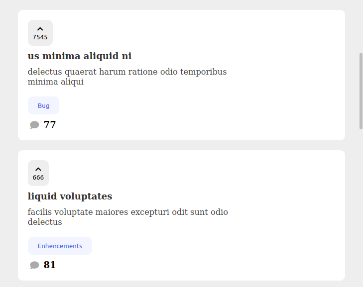
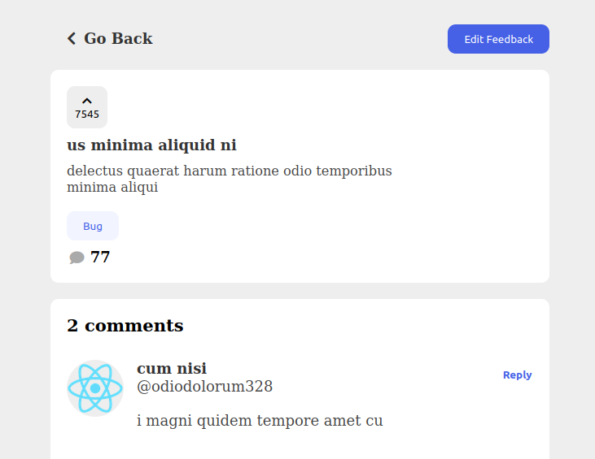
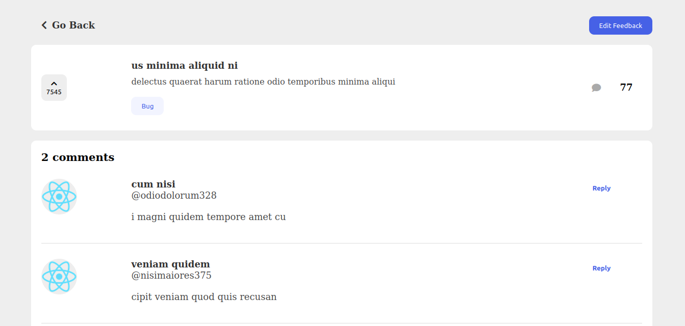
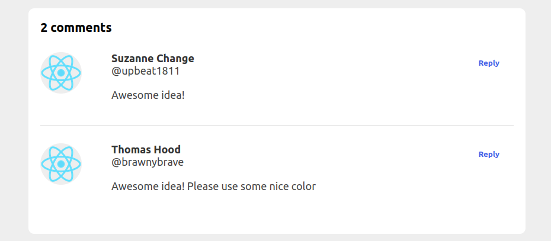
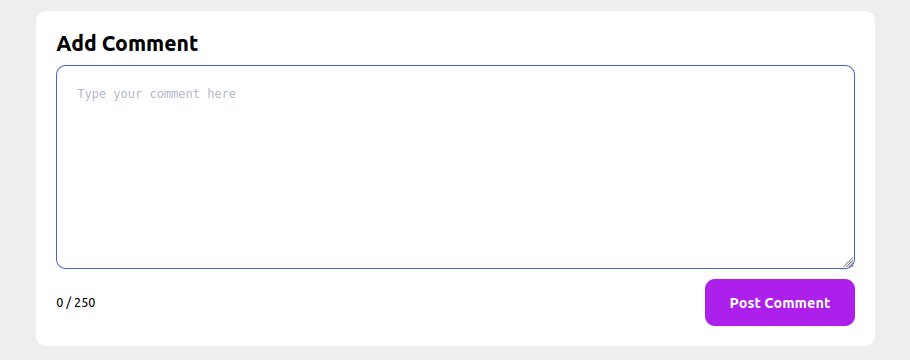

# Bootcamp React ATICMA-DEVPLACE

## [Product Feedback App](https://www.frontendmentor.io/challenges/product-feedback-app-wbvUYqjR6 "Frontend Mentor Challenge")

## Basado en [Feedback App Clone](https://hopeful-murdock-83580e.netlify.app/ "Clone by Tamir Assayag.")

## [**Básicos de Docker** y como dockerizar esta app](DOCKER.md "Básicos de Docker") 

## Screenshots

